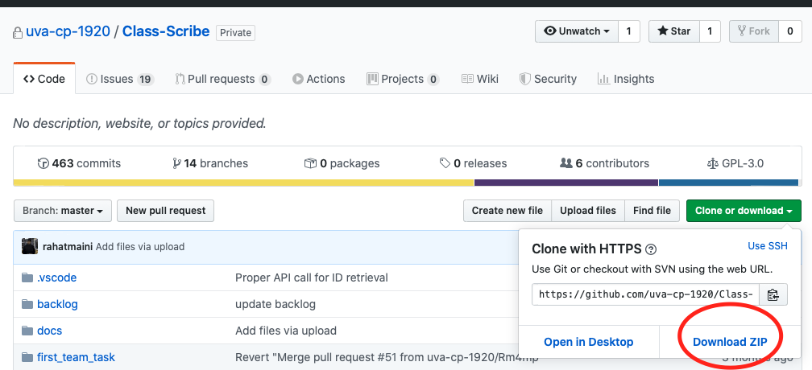
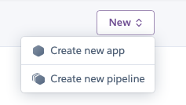
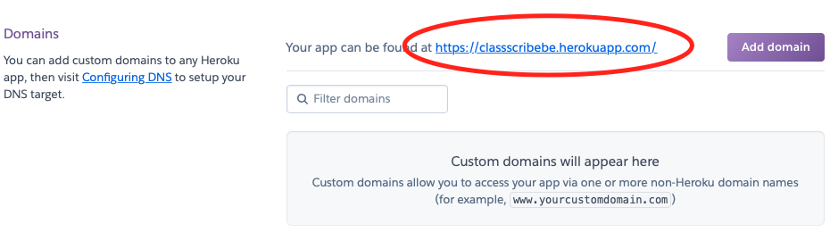
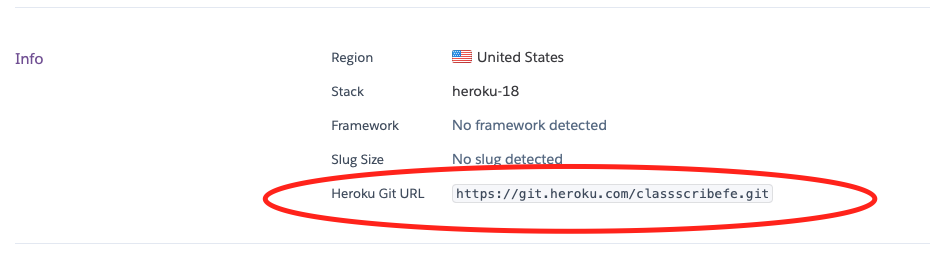

*CLASS SCRIBE INSTALLATION INSTRUCTIONS*

Prerequisite steps:
1. download heroku cli, git, node  
	heroku cli: https://devcenter.heroku.com/articles/heroku-cli#download-and-install  
	git: https://git-scm.com/downloads  
	node: https://nodejs.org/en/download/
2. download and unzip the codebase from the Class Scribe GitHub repo you should have been given access to:

3. open a console (terminal for macOS) on your computer (powershell if you are using Windows)
4. use terminal to navigate into the codebase you downloaded above
5. go to this link: https://signup.heroku.com and sign up for a Heroku account
6. create two Heroku apps in your dashboard in Heroku (one for front-end, one for back-end), use the names of your choice

Click on the backend app in your dashboard:

1. go to the settings tab
2. under the buildpacks section, select "Add buildpack" and select Python
3. open your file explorer and navigate to where the codebase was downloaded to (named Class-Scribe-master)
4. go into the src folder, then classscribe, then go to api, then open the file called views.py using a text editor
5. in the text editor, look a few lines down from the top and edit the line that starts with
"server_url", take the url for your heroku app (for example https://classscribe-be.herokuapp.com/)
in between the quotation marks on that line, and make sure to include a forward slash at the end of url when you
paste it.
  
  

Enter these following commands into your terminal, which should be pointed to the root folder (Class-Scribe-master) of the git repo that you downloaded (you can use the cd command to navigate to the folder in terminal: type 
cd "the path to the folder", where the path is the path of the downloaded code and can be copied from the file explorer window you have opened):

1. heroku login  
Follow the instructions on-screen to login to your Heroku account in the web browser that pops up
2. git remote add heroku INSERT_HEROKU_GIT_URL_FROM_HEROKU_APP_DASHBOARD_HERE  
  
3. git subtree split --prefix src/classscribe master  
(this command generates an alphanumeric string of characters you will use in the next step) 
4. heroku config:set DISABLE_COLLECTIONSTATIC=1 
5. git push heroku ABOVE_GENERATED_STRING_OF_CHARACTERS:refs/heads/master
6. heroku run python manage.py migrate --run-syncdb  

The backend should be up and running now  

Click on the frontend app (the other one of two Heroku apps you created) in your Heroku dashboard now:  

1. go to the settings tab
2. select the nodejs buildpack under the buildpacks section
3. from the root folder (Class-Scribe-master), using a file explorer, go into src, then classscribe-fe,
then go into the src folder and then open App.js with a text editor
4. in the text editor, look for the line that starts with "export const base_url", and
change the the text in the quotes on that line to the url of your BACKEND heroku app (the first app you made in these instructions, so for 
example, https://classscribe-be.herokuapp.com/), make sure to include the slash at the end of the url when
you paste it.  

In terminal:  

1. switch the git heroku repo to the new git heroku repo of the frontend app by running the following commands:     
2. git remote rm heroku
4. git remote add heroku HEROKU_GIT_URL_OF_FRONTEND_APP_ON_HEROKU_DASHBOARD_SETTINGS_PAGE_HERE  
5. git subtree split --prefix src/classscribe-fe master  
(this command generates an alphanumeric string of characters you will use in the next step)
6. git push heroku ABOVE_GENERATED_STRING_OF_CHARACTERS:refs/heads/master   
7. Refresh the herokuapps URL for the frontend should any errors occur initially when testing after successful deployment.

Happy Notetaking :)

